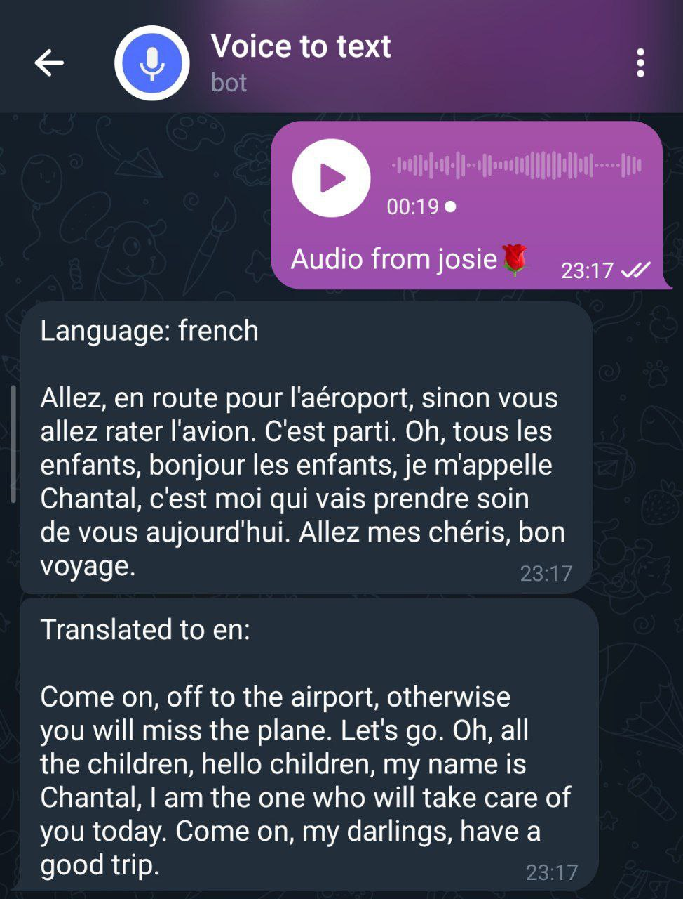
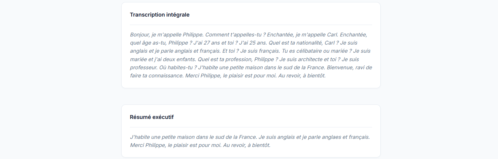

# Transcription de messages vocaux

---
- ABE Kevin                 .(https://github.com/ABE-svg)
- ALUCH Yasmine             .(https://github.com/Yasmxne)
- AYRAPETYAN Artur          .(https://github.com/aayrapet)
- GHORAFI Manal             .(https://github.com/Manalghorafi)
- MAKAMWE Pierrette Josiane .(https://github.com/josiepierr)
---

## Objectif
Ce projet a pour objectif de **convertir un message vocal en texte** avec **résumé automatique**.  
Il vise à faciliter l’analyse et la synthèse de conversations, réunions ou messages vocaux grâce à une interface API simple et efficace.

---

## Technologies utilisées
- **Flask** — Framework web pour créer l’API REST  
- **OpenAI Whisper API** / **SpeechRecognition** — Transcription vocale (speech-to-text)  
- **Transformer (BART via Hugging Face)** — Résumé automatique du texte  
- **Pytest** — Tests unitaires  
- **Docker** — Conteneurisation et déploiement reproductible  

---

## Architecture du projet

La structure arborescente du projet est la suivante :

```plaintext

                Transcription-des-messages-vocaux-/
                ├─ app/
                │  ├─ __init__.py
                │  ├─ api.py                 
                │  │
                │  ├─ docs/                       
                │  │  └─ swagger.yaml
                │  │
                │  ├─ services/                  
                │  │  ├─summary_service.py
                │  │  └─ transcribe_service.py   
                │  │
                │  ├─ static/ 
                │  │  └─ style.css
                │  │
                │  ├─ templates/ 
                │  │  ├─ base.html
                │  │  └─ index.html
                │  │
                │  └─ utils/                     
                │     └─ audio_utils.py               
                │
                ├─ tests/
                │  ├─ test_api.py  
                │  ├─ test_summary.py              
                │  └─ test_transcription.py
                │
                ├─ .dockerignore
                ├─ .gitignore
                ├─ LICENSE
                ├─ README.md
                ├─ docker-compose.yml     
                ├─ dockerfile   
                ├─ requirements.txt
                └─ setup_env.sh
```

---
## Résultats

### Chatbot Telegram
On accède au Chatbot Telegram via le lien: https://t.me/VoiceToMessage_Bot
Ce Chatbot prend en entrée des messages vocaux (ou fichiers audios) et retourne la version transcrite du dit message, avec option de traduction automatique dans la langue par défaut de l'appareil utilisé (Si l'audio est en français, anglais ou Russe seulement). Cette transcription est très sensible à l'accent de l'utilisateur. 
Note: Ces spécificités sont intrinsèquement liées à la version de Whisper API utilisée. 

Exemple de rendu sur Telegram:

<p align="center">
  
</p>

 ### Application Web
 **Prérequis**
- Docker installé
- L'utilisation en local de whisper nécessite de télécharger ffmpeg sur sa machine via le lien https://www.ffmpeg.org/download.html ,sinon la transcription renvoie une erreur.

**Lancement avec Docker**
```bash
git clone <url_du_repo>
cd Transcription-des-messages-vocaux-
docker compose up --build
```

Accès à l'interface web : http://localhost:5000

Accès à la documentation Swagger : http://localhost:5000/apidocs/

⚠️ Le premier build Docker ainsi que le chargement initial de l’interface peuvent prendre plusieurs minutes, notamment en raison du téléchargement des modèles de transcription.

Cette application prend en entrée tout type de fichier (audio, vidéo), détecte les messages audios et fait la transcription avec une option "summary", qui renvoit un résumé du message (400 mots maximum).
L'application présente différents niveaux de perfection selon la version de Whisper API utilisée: 
- tiny: Très rapide, précision limitée
- base: Bon compromis vitesse/précision
- small: Plus lent, meilleure précision (Nécessite un GPU)

Le dossier **Fichiers audios** contient des audios qui permettent à l'utilisateur de tester l'application.
 
Exemple de rendu sur l'application Web: 

<p align="center">
  
</p>
<p align="center">
  
</p>
